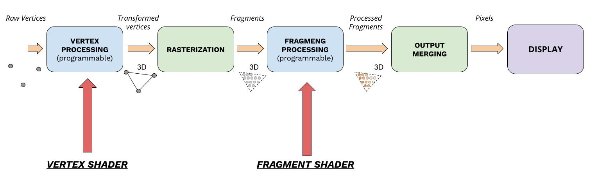

Shaders
=======

Shaders comprise the programable part of the rendering pipeline. These are
custom programs that we can create, compile and link, and that can run on the
GPU on pre-defined stages.

We'll focus on the main two programable stages for now, thus we'll analyze both
``Vertex`` and ``Fragment`` shaders.

Vertex Shaders
--------------

Vertex shaders sit on the first stages of the pipeline, and allows us to
transform vertices which are usually expressed in ``local space``, to the
actual ``world space``. As input data to this shader we have coordinates for
the vertices in such a local space, which we can expresses using the following
signature in glsl:

.. code-block:: glsl

  layout (location = 0) in vec3 position;
  layout (location = 1) in vec3 normal;
  layout (location = 2) in vec2 uv;

This tells the GPU that our shader program will receive as input vertices, and
each vertex has ``Vertex Data`` consisting of 1 vec3 position, 1 vec3 normal
(used for shading in later stages), and 1 vec2 uv (used for texture mapping in
later stages).

..
    TODO(wilbert): complete this section on vertex shaders

Example
^^^^^^^

.. code-block:: cpp

  constexpr const char* VERT_SHADER_SRC = R"(
      #version 330 core

      layout (location = 0) in vec2 pos;
      layout (location = 1) in vec3 color;

      out vec3 frag_color;

      void main() {
          gl_Position = vec4(pos, 0.0f, 1.0f);
          frag_color = color;
      }
  )";

  auto vertex_shader = std::make_unique<loco::renderer::Shader>(
        "basic_2d_vert", loco::renderer::eShaderType::VERTEX, VERT_SHADER_SRC);

Fragment Shaders
----------------

Fragment shaders sit on the last stages of the pipeline, and are in charge of
adding color to the fragments (pixels) created by the ``Rasterizer``, which are
bound to the region defined by the primitive in use (e.g. a triangle).

..
    TODO(wilbert): complete this section on fragment shaders

Example
^^^^^^^

.. code-block:: cpp

  constexpr const char* FRAG_SHADER_SRC = R"(
      #version 330 core

      in vec3 frag_color;
      out vec4 output_color;

      void main() {
          output_color = vec4(frag_color, 1.0f);
      }
  )";

  auto fragment_shader = std::make_unique<loco::renderer::Shader>(
      "basic_2d_frag", loco::renderer::eShaderType::FRAGMENT,
      FRAG_SHADER_SRC);

===================
C++ API Reference
===================

.. doxygenclass:: renderer::Shader
   :members:

.. doxygenclass:: renderer::Program
   :members:
